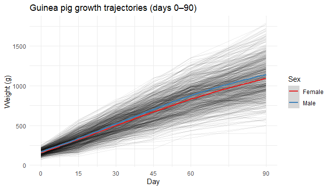
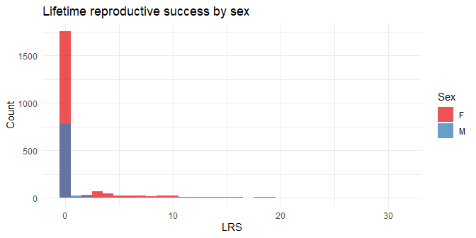

<!-- README.md is generated from README.Rmd. Please edit that file -->

# pedigreedata

<!-- badges: start -->

[](https://github.com/R-Computing-Lab/pedigreedata/actions/workflows/R-CMD-check.yaml)
[](https://app.codecov.io/gh/R-Computing-Lab/pedigreedata)
<!-- badges: end -->

`pedigreedata` is an umbrella data package that provides curated
pedigree and phenotype datasets for use in quantitative genetics and
behavior genetics research. Each dataset has been validated for pedigree
integrity and is ready for use with packages such as
[BGmisc](https://github.com/R-Computing-Lab/BGmisc) and
[ggpedigree](https://github.com/R-Computing-Lab/ggpedigree).

## Datasets

| Dataset | Description | Individuals | Source |
|----|----|----|----|
| `guinea_pigs` | Four-generation controlled breeding study of *Cavia porcellus* with repeated body weight measurements (days 0–90) | 10892 | [Figshare](https://doi.org/10.6084/m9.figshare.31513204.v2) |
| `red_squirrels` | 35+ years of pedigree and fitness data for wild North American red squirrels (*Tamiasciurus hudsonicus*) from the Kluane Red Squirrel Project | 7799 | [Dryad](https://doi.org/10.5061/dryad.n5q05) |
| `war_of_the_roses` | Pedigree of key figures in the 15th-century English Wars of the Roses, rooted at Edward III | 95 | Public genealogical records |

## Installation

You can install the development version of pedigreedata from
[GitHub](https://github.com/) with:

``` r
# install.packages("pak")
pak::pak("R-Computing-Lab/pedigreedata")
```

## Quick start

``` r
library(pedigreedata)

# Guinea pig growth data
head(guinea_pigs[, c("ID", "dadID", "momID", "sexo", "famID", "p0", "p90")])
#>       ID dadID momID sexo famID  p0  p90
#> 1  001-1  M002     1    M    NA 130 1086
#> 2  001-2  M002     1    M    NA 142 1118
#> 3 001-21  M002     1    H    NA 156  824
#> 4 001-22  M002     1    M    NA 142  926
#> 5 001-31  M002     1    H    NA 114  950
#> 6 001-33  M002     1    M    NA  94   NA

# Red squirrel fitness data
head(red_squirrels[, c("personID", "momID", "dadID", "sex", "byear", "lrs")])
#>   personID momID dadID sex byear lrs
#> 1        1    NA    NA   F    NA  NA
#> 2        2    NA    NA   F    NA  NA
#> 3        3    NA    NA   F    NA  NA
#> 4        4    NA    NA   F    NA  NA
#> 5        5    NA    NA   F    NA  NA
#> 6        6    NA    NA   F    NA  NA

# Wars of the Roses pedigree
head(war_of_the_roses[, c("id", "name", "sex", "momID", "dadID", "famID")])
#>   id                                    name sex momID dadID famID
#> 1  1                              Edward III   M    NA    NA     1
#> 2  2                    Phillipa of Hainault   F    NA    NA     1
#> 3  3                 Edward The Black Prince   M     2     1     1
#> 4  4                            Joan of Kent   F    95    94     1
#> 5  5 Isabella of England Countess of Bedford   F     2     1     1
#> 6  6            Enguerrand VII Lord of Coucy   M    NA    NA     2
```

## Guinea pigs

`guinea_pigs` combines a four-generation pedigree with body weights
measured at six ages (days 0, 15, 30, 45, 60, and 90). Key variables
include litter size, season of birth (*invierno* / *verano*), coat
color, and housing pen.

``` r
library(ggplot2)
library(dplyr)
library(tidyr)

growth_long <- guinea_pigs |>
  filter(!is.na(p0)) |>
  select(ID, sexo, p0, p15, p30, p45, p60, p90) |>
  pivot_longer(starts_with("p"), names_to = "day", values_to = "weight") |>
  mutate(day = as.numeric(sub("p", "", day)))

set.seed(42)
ids <- sample(unique(growth_long$ID), 800)

ggplot(growth_long |> filter(ID %in% ids),
       aes(x = day, y = weight, group = ID)) +
  geom_line(alpha = 0.08) +
  geom_smooth(aes(group = sexo, color = sexo), method = "loess", se = TRUE) +
  scale_x_continuous(breaks = c(0, 15, 30, 45, 60, 90)) +
  scale_color_brewer(palette = "Set1",
                     labels = c("H" = "Female", "M" = "Male"),
                     na.value = "grey50") +
  labs(title = "Guinea pig growth trajectories (days 0–90)",
       x = "Day", y = "Weight (g)", color = "Sex") +
  theme_minimal()
```



## Red squirrels

`red_squirrels` spans over 35 years of individual-level data from a wild
boreal population. Fitness traits include lifetime reproductive success
(LRS) and mean annual reproductive success (ARS).

``` r
red_squirrels |>
  filter(!is.na(lrs), !is.na(sex)) |>
  ggplot(aes(x = lrs, fill = sex)) +
  geom_histogram(binwidth = 1, alpha = 0.75, position = "identity") +
  scale_fill_brewer(palette = "Set1") +
  labs(title = "Lifetime reproductive success by sex",
       x = "LRS", y = "Count", fill = "Sex") +
  theme_minimal()
```



## War of the Roses

`war_of_the_roses` encodes the competing dynastic claims of Lancaster
and York. Each individual has a Wikipedia URL, making it straightforward
to trace lineages.

``` r
# Key claimants and their relationship to Edward III (id = 1)
war_of_the_roses |>
  filter(name %in% c("Edward III", "Henry IV", "Henry V", "Henry VI",
                     "Richard Duke of York", "Edward IV", "Richard III",
                     "Henry VII")) |>
  select(id, name, sex, momID, dadID) |>
  arrange(id)
#>   id                 name sex momID dadID
#> 1  1           Edward III   M    NA    NA
#> 2 34              Henry V   M    31    32
#> 3 41             Henry VI   M    35    34
#> 4 53 Richard Duke of York   M    25    26
#> 5 55            Edward IV   M    52    53
#> 6 62          Richard III   M    52    53
```

## Vignettes

Each dataset has a dedicated vignette:

- `vignette("guinea-pig", package = "pedigreedata")` — growth
  trajectories, litter structure, seasonal effects
- `vignette("red-squirrels", package = "pedigreedata")` — lifespan,
  LRS/ARS distributions, birth cohort trends
- `vignette("wars-of-the-roses", package = "pedigreedata")` — dynastic
  lineages and succession rules

## License

GPL (\>= 3)
